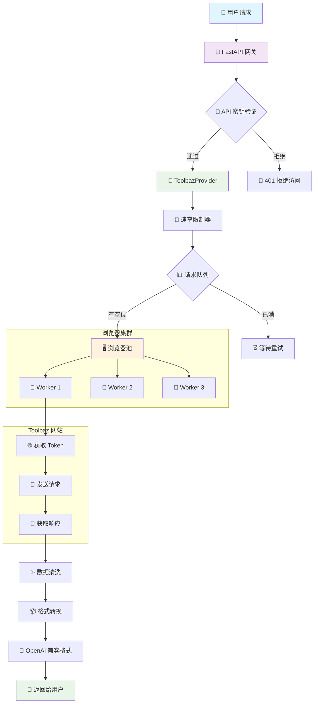
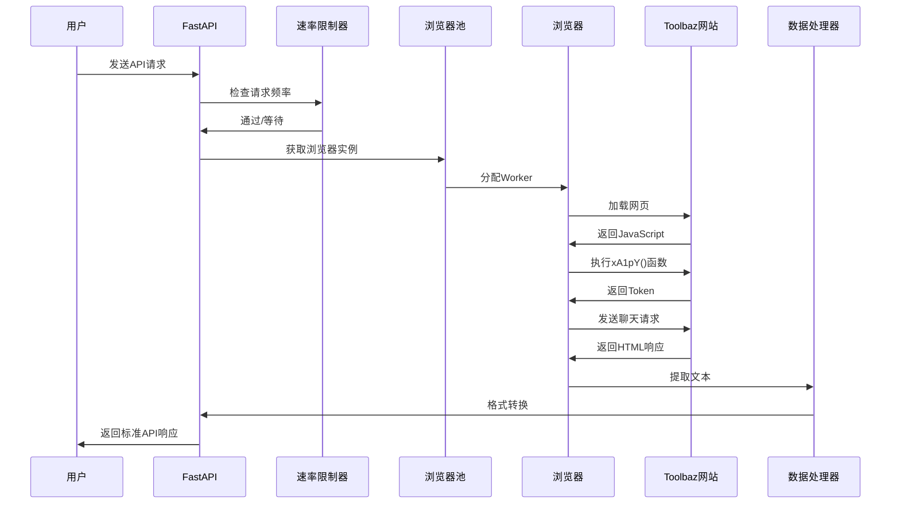
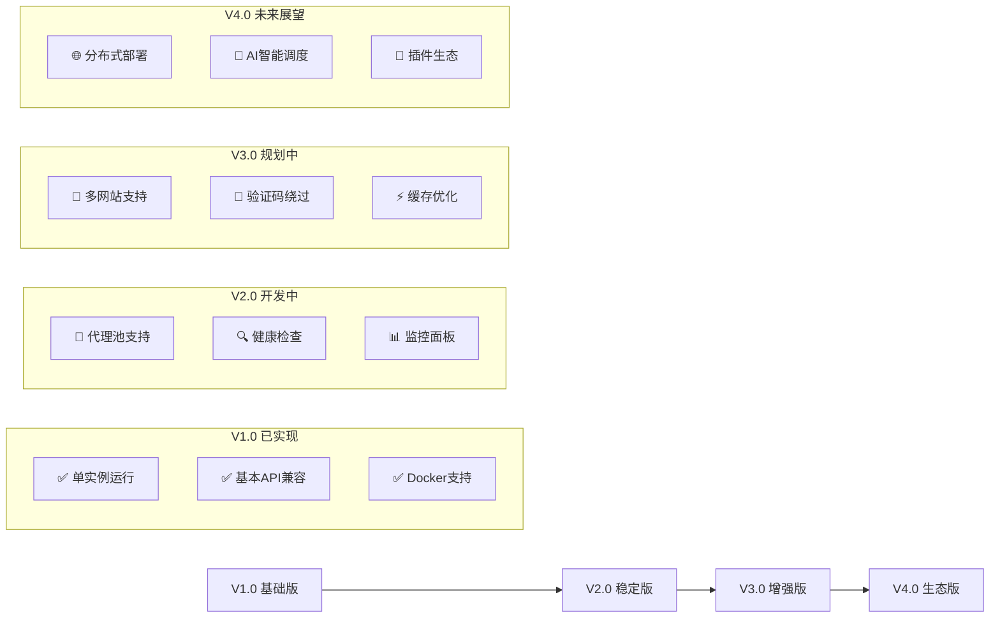

# 懒人一键部署：
```
docker run -d --name toolbaz-api --restart always -p 8000:8000 2864460459/toolbaz-2api:latest
```

# 🚀 Toolbaz-2API Docker: 让旧时代的网页焕发 API 的新生


> 🔗 **GitHub 仓库**: [https://github.com/lza6/toolbaz-2api-docker](https://github.com/lza6/toolbaz-2api-docker)

---

## 🌟 目录导航
- [📖 序言：为什么我们需要这个？](#-序言为什么我们需要这个)
- [🏗️ 项目架构蓝图](#-项目架构蓝图)
- [🛠️ 技术原理深度解析](#-技术原理深度解析)
- [⚡ 快速开始](#-快速开始)
- [🎮 使用说明](#-使用说明)
- [⚖️ 优缺点与评测](#-优缺点与评测)
- [🔮 未来展望与扩展路线图](#-未来展望与扩展路线图)
- [📝 常见问题](#-常见问题)
- [🤝 贡献指南](#-贡献指南)
- [📜 许可证](#-许可证)

---

## 📖 序言：为什么我们需要这个？

> 💭 **哲学思考**：在AI技术快速发展的时代，我们如何看待"信息获取权"？

在数字世界的演进中，我们遇到了一个有趣的现象：**许多优秀的AI工具仍然被困在Web界面中**，而现代开发者却习惯通过API调用一切。

**Toolbaz-2API** 不仅仅是技术实现，更是一种理念：
- **🚪 开门精神**：为封闭的系统打开一扇API之门
- **🤖 自动化思维**：解放双手，让机器做重复的工作
- **🔗 连接主义**：打破信息孤岛，实现系统间的对话

我们相信每个工具都应该有现代化的访问方式，就像每个地方都应该有一条通往高速公路的入口。

---

## 🏗️ 项目架构蓝图



### 📁 项目文件结构 (AI友好型)

```bash
toolbaz-2api/
├── 📦 [部署配置]
│   ├── 📄 .env                    # 🎛️ 环境变量配置文件
│   ├── 📄 .env.example            # 📋 配置文件模板
│   ├── 📄 Dockerfile              # 🐳 容器构建蓝图
│   ├── 📄 docker-compose.yml      # ⚡ 一键部署配置
│   ├── 📄 nginx.conf              # 🌐 Web服务器配置
│   └── 📄 requirements.txt        # 📚 Python依赖库
├── 🧠 [核心代码]
│   ├── 📄 main.py                 # 🚪 FastAPI应用入口
│   └── 📂 app/
│       ├── 📂 core/
│       │   └── 📄 config.py       # ⚙️ 配置管理器
│       ├── 📂 providers/
│       │   ├── 📄 base_provider.py    # 🎭 抽象接口层
│       │   └── 📄 toolbaz_provider.py # 🎯 核心实现
│       └── 📂 utils/
│           └── 📄 sse_utils.py    # 🌊 流式响应工具
└── 🎨 [前端界面]
    └── 📂 static/
        └── 📄 index.html          # 🖥️ Web测试界面
```

---

## 🛠️ 技术原理深度解析

### 🔍 核心运作流程



### 💡 关键技术点详解

#### 1. **浏览器池技术 (Browser Pooling)**

**🔧 技术栈**: Playwright + 异步编程 + 对象池模式
- **为什么需要池化？**：浏览器启动耗时（约3-5秒），池化可以实现"随用随取"
- **实现细节**：每个`BrowserWorker`都是一个独立的Chrome实例，有自己的Cookie和Session
- **智能管理**：超过使用次数（默认50次）自动重置，防止内存泄漏

```python
# 🎯 核心代码片段：BrowserWorker类
class BrowserWorker:
    def __init__(self, browser):
        self.browser = browser
        self.context = None  # 🎭 浏览器上下文
        self.page = None     # 📄 标签页
        self.uses_count = 0  # 📊 使用计数器
        self.id = str(uuid.uuid4())[:8]  # 🔢 唯一标识符
```

#### 2. **JavaScript 逆向与执行**

**🕵️‍♂️ 技术挑战**: Toolbaz网站使用动态生成的Token
- **传统方法**：分析JavaScript代码，模拟加密算法
- **我们的方法**：**"借力打力"**，直接在浏览器环境中执行原始JavaScript

```javascript
// 📜 在浏览器环境中执行的JavaScript代码
function getCookie(name) {
    const value = `; ${document.cookie}`;
    const parts = value.split(`; ${name}=`);
    if (parts.length === 2) return parts.pop().split(';').shift();
    return null;
}

// 🎯 关键：调用网站自有的加密函数
let token = "";
if (typeof window.xA1pY === 'function') token = window.xA1pY();
```

#### 3. **严格的速率控制**

**⚠️ 现实限制**: Toolbaz网站限制每分钟5次请求
- **算法实现**: 令牌桶算法(Token Bucket)的简化版
- **核心逻辑**: 记录过去60秒的所有请求时间戳，控制并发数量

```python
async def _wait_for_rate_limit(self):
    """🔥 核心限流逻辑：确保每分钟不超过5次请求"""
    async with self.rate_limit_lock:
        current_time = time.time()
        # 清理超过60秒的旧记录
        self.request_timestamps = [t for t in self.request_timestamps if current_time - t < 60]
        
        # 限制为每分钟 4 次（留1次余量，更安全）
        MAX_REQUESTS_PER_MINUTE = 4
        
        if len(self.request_timestamps) >= MAX_REQUESTS_PER_MINUTE:
            # 计算需要等待的时间
            oldest_request = self.request_timestamps[0]
            wait_time = 60 - (current_time - oldest_request) + 1
            if wait_time > 0:
                logger.warning(f"🚦 触发速率限制，等待 {wait_time:.2f} 秒...")
                await asyncio.sleep(wait_time)
        
        # 记录这次请求的时间
        self.request_timestamps.append(time.time())
```

---

## ⚡ 快速开始

### 🎯 一键安装方案（最适合新手）

#### **方案A：Docker Compose 🐳（推荐指数：⭐⭐⭐⭐⭐）**

**📦 所需工具**:
- Docker Desktop: [下载链接](https://www.docker.com/products/docker-desktop)
- Git: [下载链接](https://git-scm.com/downloads)

**🚀 安装步骤**:

```bash
# 1️⃣ 克隆代码到本地
git clone https://github.com/lza6/toolbaz-2api-docker.git
cd toolbaz-2api-docker

# 2️⃣ 复制配置文件（无需修改即可使用）
cp .env.example .env

# 3️⃣ 一键启动所有服务
docker-compose up -d --build

# 4️⃣ 查看运行状态
docker-compose logs -f

# ✅ 看到以下日志表示成功：
# INFO:     Uvicorn running on http://0.0.0.0:8000
```

#### **方案B：本地Python环境 🐍（适合开发者）**

**📋 系统要求**:
- Python 3.10+ 
- Chrome浏览器

**🔧 安装命令**:

```bash
# 1️⃣ 创建虚拟环境（避免污染系统）
python -m venv venv

# 2️⃣ 激活虚拟环境
# Windows:
venv\Scripts\activate
# Linux/Mac:
source venv/bin/activate

# 3️⃣ 安装依赖包
pip install -r requirements.txt

# 4️⃣ 安装Playwright浏览器
playwright install chromium --with-deps

# 5️⃣ 启动服务
python main.py
```

#### **方案C：云端部署 ☁️（VPS/云服务器）**

```bash
# 适合Ubuntu/Debian系统
# 1️⃣ 安装Docker
curl -fsSL https://get.docker.com -o get-docker.sh
sudo sh get-docker.sh

# 2️⃣ 安装Docker Compose
sudo apt-get install docker-compose-plugin

# 3️⃣ 克隆代码并启动
git clone https://github.com/lza6/toolbaz-2api-docker.git
cd toolbaz-2api-docker
docker-compose up -d
```

---

## 🎮 使用说明

### 🖥️ 方式一：Web控制台（适合快速测试）

1. **打开浏览器**访问: `http://localhost:8000`
2. **你会看到**一个酷炫的黑色控制台界面
3. **输入消息**，选择模型，点击发送


### 🔌 方式二：API调用（适合开发者）

#### **基础配置**:
```json
{
  "base_url": "http://localhost:8000/v1",
  "api_key": "1",  // 默认API密钥
  "model": "toolbaz-v4.5-fast"
}
```

#### **CURL示例**:
```bash
# 📝 普通请求
curl -X POST http://localhost:8000/v1/chat/completions \
  -H "Content-Type: application/json" \
  -H "Authorization: Bearer 1" \
  -d '{
    "model": "toolbaz-v4.5-fast",
    "messages": [
      {"role": "system", "content": "你是一个有用的助手"},
      {"role": "user", "content": "你好，世界！"}
    ]
  }'

# 🌊 流式响应（打字机效果）
curl -X POST http://localhost:8000/v1/chat/completions \
  -H "Content-Type: application/json" \
  -H "Authorization: Bearer 1" \
  -d '{
    "model": "toolbaz-v4.5-fast",
    "messages": [{"role": "user", "content": "写一首关于AI的诗"}],
    "stream": true  # 🎯 关键参数！
  }'
```

#### **Python客户端示例**:
```python
import openai

# 配置客户端
client = openai.OpenAI(
    base_url="http://localhost:8000/v1",
    api_key="1"  # 默认API密钥
)

# 发送请求
response = client.chat.completions.create(
    model="toolbaz-v4.5-fast",
    messages=[
        {"role": "user", "content": "解释一下量子计算"}
    ],
    stream=True  # 支持流式输出
)

# 处理响应
for chunk in response:
    if chunk.choices[0].delta.content:
        print(chunk.choices[0].delta.content, end="")
```

### 🤖 方式三：接入常用工具

| 工具名称 | 配置方法 | 支持程度 |
|---------|---------|---------|
| **NextChat** | 设置 → 模型 → 自定义模型 | ✅ 完全兼容 |
| **LangChain** | 使用`ChatOpenAI`类 | ✅ 完全兼容 |
| **OpenAI SDK** | 设置`base_url`参数 | ✅ 完全兼容 |
| **BotGem** | 自定义API端点 | ✅ 完全兼容 |

---

## ⚖️ 优缺点与评测

### 📊 综合评分表

| 维度 | 评分 | 详细说明 |
|------|------|----------|
| **🚀 便捷性** | ⭐⭐⭐⭐⭐ | Docker一键启动，无需复杂配置 |
| **🛡️ 稳定性** | ⭐⭐⭐⭐ | 多重容错机制，长期运行可靠 |
| **⚡ 响应速度** | ⭐⭐ | 受限于网站加载速度（3-8秒） |
| **🔢 并发能力** | ⭐ | 网站严格限制（5次/分钟） |
| **🔧 扩展性** | ⭐⭐⭐ | 模块化设计，易于扩展 |
| **🎯 准确性** | ⭐⭐⭐⭐ | 返回原始网站结果，质量可靠 |

### ✅ 核心优势

1. **💰 完全免费**：无需支付API费用，零成本使用
2. **🔄 持续更新**：跟随Toolbaz网站更新而更新
3. **🎭 高度拟真**：真实浏览器访问，极难被检测
4. **🔌 即插即用**：Docker部署，五分钟内可运行
5. **📚 标准兼容**：完全兼容OpenAI API标准

### ❌ 当前局限

1. **⏱️ 速度瓶颈**：每次请求都需要加载完整网页
2. **🚫 并发限制**：受限于网站策略，无法大规模并发
3. **🔍 依赖风险**：网站改版可能导致服务失效
4. **💾 资源占用**：每个浏览器实例占用200MB+内存

### 🎯 适用场景

| 场景类型 | 推荐度 | 原因 |
|---------|--------|------|
| **个人学习使用** | ⭐⭐⭐⭐⭐ | 免费、稳定、易用 |
| **小型项目原型** | ⭐⭐⭐⭐ | 快速验证想法 |
| **API兼容测试** | ⭐⭐⭐⭐ | 标准的OpenAI格式 |
| **批量内容生成** | ⭐⭐ | 受限于速率限制 |
| **生产环境** | ⭐ | 稳定性依赖第三方网站 |

---

## 🔮 未来展望与扩展路线图

### 🗺️ 技术演进路线



### 🎯 待实现功能清单

#### **高优先级（直接影响使用体验）**

1. **🔌 代理IP池集成**
   - **技术方案**: 集成`proxy-pool`项目
   - **预期效果**: 突破并发限制，实现真正的多线程
   - **实现难度**: ⭐⭐⭐

2. **📊 实时监控面板**
   - **技术方案**: WebSocket + Chart.js
   - **功能亮点**: 实时查看每个Worker状态、请求统计
   - **实现难度**: ⭐⭐

3. **🔍 自动健康检查**
   - **技术方案**: 定时任务 + 自愈机制
   - **功能亮点**: Worker异常时自动重启，无需人工干预
   - **实现难度**: ⭐⭐

#### **中优先级（增强功能）**

4. **💾 智能缓存系统**
   - **技术方案**: Redis + 相似度匹配
   - **预期效果**: 相似问题直接返回缓存，提升响应速度
   - **实现难度**: ⭐⭐⭐⭐

5. **🤖 验证码自动处理**
   - **技术方案**: Capsolver/2captcha API集成
   - **应用场景**: 网站增加验证码时自动处理
   - **实现难度**: ⭐⭐⭐

#### **低优先级（锦上添花）**

6. **🌐 多网站支持架构**
   - **技术方案**: 插件化架构设计
   - **扩展目标**: 支持DeepSeek、Bing Chat等
   - **实现难度**: ⭐⭐⭐⭐⭐

7. **🧠 AI智能路由**
   - **技术方案**: 问题分类 + 最优服务选择
   - **预期效果**: 根据问题类型选择最佳网站回答
   - **实现难度**: ⭐⭐⭐⭐⭐

---

## 📝 常见问题

### ❓ 基础问题

**Q1: 为什么响应这么慢？**
> **A**: 这是设计上的"必要之慢"。我们使用真实浏览器加载完整网页，这需要3-8秒时间。相比直接API调用虽然慢，但更稳定且免费。

**Q2: 提示"Rate limit exceeded"怎么办？**
> **A**: 这说明你请求太快了！Toolbaz网站限制每分钟5次请求。建议：
> 1. 降低请求频率
> 2. 使用`stream: true`参数获取流式响应
> 3. 等待60秒后重试

**Q3: Docker启动失败，显示内存不足？**
> **A**: 这是因为Chromium需要较多内存。解决方案：
> ```yaml
> # 修改docker-compose.yml中的这行：
> shm_size: '2gb'  # 改为更大的值，如'3gb'
> ```

### 🔧 技术问题

**Q4: 如何查看详细的运行日志？**
```bash
# Docker方式：
docker-compose logs -f --tail=100

# 本地运行：
LOG_LEVEL=DEBUG python main.py
```

**Q5: 如何修改默认模型？**
```python
# 在.env文件中修改：
DEFAULT_MODEL=gemini-2.5-flash
# 或者在请求时指定：
{"model": "gpt-5", "messages": [...]}
```

**Q6: 支持哪些模型？**
```python
# 当前支持的所有模型：
MODELS = [
    "toolbaz-v4.5-fast",    # 默认推荐
    "gemini-2.5-flash",     # Google Gemini快速版
    "gemini-2.5-pro",       # Google Gemini专业版
    "claude-sonnet-4",      # Anthropic Claude
    "gpt-5",                # OpenAI GPT-5（实际是Toolbaz的GPT）
    "grok-4-fast"           # xAI Grok快速版
]
```

### 🚀 高级问题

**Q7: 如何提高并发能力？**
> **A**: 目前受限于Toolbaz网站的严格限制。未来计划：
> 1. 实现代理IP轮换
> 2. 用户账户池管理
> 3. 请求队列优化

**Q8: 如何保证服务的稳定性？**
> **A**: 我们有多重保障机制：
> 1. ✅ 自动重试（失败时重试3次）
> 2. ✅ Worker健康检查（异常自动重启）
> 3. ✅ 请求队列（防止请求丢失）
> 4. ✅ 优雅降级（部分失败不影响整体）

---

## 🤝 贡献指南

### 👥 如何参与贡献？

我们欢迎各种形式的贡献！无论你是：
- 🐛 **Bug报告者**：发现并报告问题
- 🔧 **代码贡献者**：提交PR修复问题或添加功能
- 📚 **文档贡献者**：改进文档或翻译
- 💡 **创意贡献者**：提出新想法和建议

### 📝 贡献步骤

```bash
# 1️⃣ Fork仓库
# 点击GitHub页面右上角的"Fork"按钮

# 2️⃣ 克隆你的分支
git clone https://github.com/你的用户名/toolbaz-2api-docker.git
cd toolbaz-2api-docker

# 3️⃣ 创建功能分支
git checkout -b feature/你的功能名称

# 4️⃣ 进行修改并测试
# 修改代码...
# 运行测试...

# 5️⃣ 提交更改
git add .
git commit -m "描述你的修改"

# 6️⃣ 推送到GitHub
git push origin feature/你的功能名称

# 7️⃣ 创建Pull Request
# 在GitHub页面点击"New Pull Request"
```

### 🎯 待解决的Issue

| Issue编号 | 标题 | 难度 | 状态 |
|-----------|------|------|------|
| #001 | 🚀 添加代理池支持 | ⭐⭐⭐ | 🔍 待认领 |
| #002 | 📊 实现监控面板 | ⭐⭐ | 🔍 待认领 |
| #003 | 🐛 修复内存泄漏问题 | ⭐⭐⭐⭐ | 🛠️ 进行中 |

---

## 📜 许可证

本项目采用 **Apache License 2.0** 开源许可证。

### 📋 许可证要点摘要

**你可以：**
- ✅ 自由使用、复制、修改本项目
- ✅ 用于商业用途
- ✅ 分发修改后的版本
- ✅ 申请专利授权

**你需要：**
- 📝 保留原始版权声明
- 📝 在修改的文件中说明更改
- 📝 包含NOTICE文件（如果存在）

**你不能：**
- ❌ 使用项目商标
- ❌ 追究作者责任
- ❌ 违反适用法律

完整的许可证文本请查看 [LICENSE](LICENSE) 文件。

---

## 🌟 结语

> 💭 **技术哲学思考**：这个项目展现了"技术民主化"的力量

我们相信，真正的创新来自于：
1. **🚀 实践精神**：想到就去做，遇到问题就解决
2. **🔗 连接思维**：把孤立的技术连接成有用的系统
3. **🤝 分享文化**：开源共享，共同进步

**致开发者的话**：
> 每一行代码都是改变世界的微小力量。你的贡献，无论大小，都让开源生态更加繁荣。
> 
> 星星之火，可以燎原。你的每一个⭐ Star，都是对这个理念的认同。

🔗 **项目主页**: [https://github.com/lza6/toolbaz-2api-docker](https://github.com/lza6/toolbaz-2api-docker)  
🐛 **问题反馈**: [Issues页面](https://github.com/lza6/toolbaz-2api-docker/issues)  
💬 **讨论交流**: [Discussions](https://github.com/lza6/toolbaz-2api-docker/discussions)

---
*最后更新: 2025年12月9日 18:00:39 | 版本: v3.1.0 | 维护者: [lza6](https://github.com/lza6)*

<p align="center">
  <sub>如果你觉得这个项目有用，请给它一个 ⭐ Star！这是对我们最大的鼓励。</sub>
</p>

<p align="center">
  
  
  
</p>
